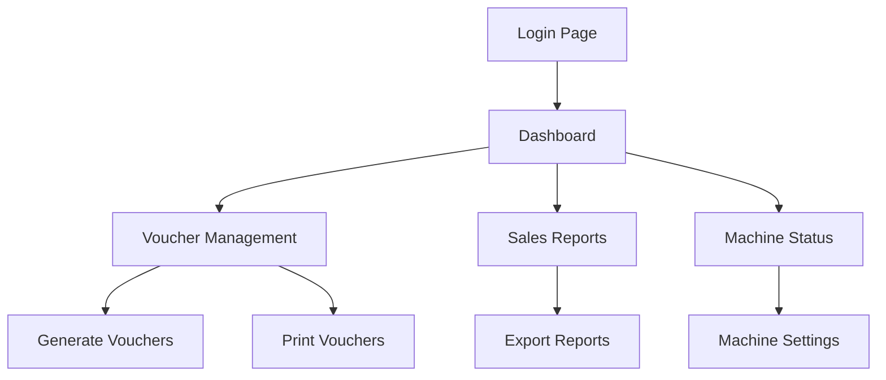

## 1. Product Overview
A web-based Piso Wifi management system that allows administrators to monitor sales, generate vouchers, and manage wifi access. The system enables efficient control of wifi vending machines with real-time status monitoring and automated voucher generation.

Target users are Piso Wifi business owners who need to manage multiple wifi vending machines, track sales performance, and generate vouchers for customers.

## 2. Core Features

### 2.1 User Roles
| Role | Registration Method | Core Permissions |
|------|---------------------|------------------|
| Admin | Manual creation by system owner | Full access to dashboard, voucher management, sales reports, system settings |
| Operator | Admin invitation | Limited access to specific machines, basic voucher generation, view sales data |

### 2.2 Feature Module
Our Piso Wifi management system consists of the following main pages:
1. **Login page**: Admin authentication, password reset option.
2. **Dashboard page**: Sales overview, voucher statistics, machine status monitoring.
3. **Voucher management page**: Generate vouchers, view voucher list, print vouchers.
4. **Sales report page**: Daily/weekly/monthly sales data, export reports.
5. **Machine status page**: Real-time machine connectivity, usage statistics.

### 2.3 Page Details
| Page Name | Module Name | Feature description |
|-----------|-------------|---------------------|
| Login page | Authentication | Admin login with email/password, session management, password reset functionality. |
| Dashboard page | Sales Overview | Display total sales today, active vouchers, machine count, revenue trends chart. |
| Dashboard page | Voucher Statistics | Show generated vouchers count, used vouchers, expired vouchers, success rate. |
| Dashboard page | Machine Status | Real-time connectivity status, last seen timestamp, error notifications. |
| Voucher management page | Generate Vouchers | Create single or batch vouchers with custom denominations (1, 5, 10 pesos). |
| Voucher management page | Voucher List | Display all vouchers with status (active/used/expired), search and filter options. |
| Voucher management page | Print Vouchers | Select vouchers for printing, generate printable format with QR codes. |
| Sales report page | Daily Reports | Show hourly sales breakdown, total revenue, voucher usage patterns. |
| Sales report page | Export Reports | Download sales data as CSV/Excel files for accounting purposes. |
| Machine status page | Connectivity Monitor | Display online/offline status for all machines, connection history. |
| Machine status page | Usage Statistics | Show data consumption, user count per machine, performance metrics. |

## 3. Core Process
Admin Flow:
1. Admin logs into the system using email and password
2. Dashboard displays overview of sales, vouchers, and machine status
3. Admin can generate new vouchers with specific denominations
4. Admin monitors machine connectivity and performance
5. Admin views and exports sales reports for business analysis

Operator Flow:
1. Operator logs in with limited credentials
2. Access restricted dashboard with assigned machines only
3. Generate vouchers for assigned machines
4. View basic sales data for assigned machines

## 4. User Interface Design

### 4.1 Design Style
- Primary colors: Blue (#2563eb) for primary actions, Green (#16a34a) for success states
- Secondary colors: Gray (#6b7280) for secondary text, Red (#dc2626) for errors
- Button style: Rounded corners (8px radius), clear hover states, consistent sizing
- Font: Inter font family, 16px base size, clear hierarchy with 1.25 ratio
- Layout style: Card-based layout with top navigation, responsive grid system
- Icons: Heroicons for consistency, clear visual hierarchy

### 4.2 Page Design Overview
| Page Name | Module Name | UI Elements |
|-----------|-------------|-------------|
| Login page | Authentication | Centered card layout, company logo, email/password fields, login button, forgot password link. |
| Dashboard page | Sales Overview | Large metric cards showing key numbers, line chart for revenue trends, color-coded status indicators. |
| Dashboard page | Voucher Statistics | Circular progress indicators, data tables with sorting, quick action buttons. |
| Voucher management page | Generate Vouchers | Form with denomination selector, quantity input, batch name field, generate button with loading state. |
| Voucher management page | Voucher List | Data table with search bar, status badges, action buttons per row, pagination controls. |
| Sales report page | Daily Reports | Date range picker, bar chart for hourly sales, summary cards, export button prominently placed. |
| Machine status page | Connectivity Monitor | Grid of machine cards showing status lights, last seen timestamp, quick actions for each machine. |

### 4.3 Responsiveness
Desktop-first design approach with mobile adaptation. The system will be primarily used on desktop computers for better data visualization and management efficiency. Mobile version will maintain core functionality with simplified layouts for basic monitoring and voucher generation on-the-go.

### 4.4 3D Scene Guidance
Not applicable for this web application as it focuses on data management and business operations rather than 3D visualization.