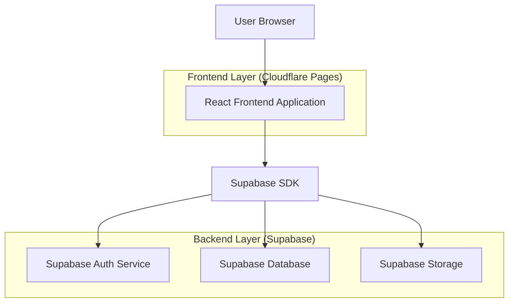
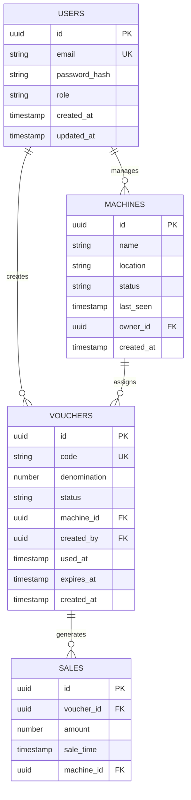

## 1. Architecture design



## 2. Technology Description
- Frontend: React@18 + tailwindcss@3 + vite
- Initialization Tool: vite-init
- Backend: Supabase (PostgreSQL, Authentication, Storage)
- Deployment: Cloudflare Pages (static site hosting)

## 3. Route definitions
| Route | Purpose |
|-------|---------|
| / | Login page, user authentication |
| /dashboard | Main dashboard with sales overview and machine status |
| /vouchers | Voucher management page for generating and listing vouchers |
| /reports | Sales reports page with export functionality |
| /machines | Machine status monitoring page |
| /settings | System settings and user profile management |

## 4. API definitions

### 4.1 Authentication API
```
POST /auth/v1/token
```

Request:
| Param Name | Param Type | isRequired | Description |
|------------|------------|------------|-------------|
| email | string | true | Admin email address |
| password | string | true | Admin password |

Response:
| Param Name | Param Type | Description |
|------------|------------|-------------|
| access_token | string | JWT token for authentication |
| refresh_token | string | Token for refreshing session |
| user | object | User data object |

### 4.2 Voucher Management API
```
GET /rest/v1/vouchers
POST /rest/v1/vouchers
PUT /rest/v1/vouchers
DELETE /rest/v1/vouchers
```

Request (POST):
| Param Name | Param Type | isRequired | Description |
|------------|------------|------------|-------------|
| denomination | number | true | Voucher value (1, 5, 10 pesos) |
| code | string | true | Unique voucher code |
| status | string | true | Voucher status (active/used/expired) |
| machine_id | string | false | Assigned machine ID |

## 5. Server architecture diagram
Not applicable - using Supabase as Backend-as-a-Service platform with direct client-side integration.

## 6. Data model

### 6.1 Data model definition


### 6.2 Data Definition Language

Users Table (users)
```sql
-- create table
CREATE TABLE users (
    id UUID PRIMARY KEY DEFAULT gen_random_uuid(),
    email VARCHAR(255) UNIQUE NOT NULL,
    password_hash VARCHAR(255) NOT NULL,
    role VARCHAR(20) DEFAULT 'operator' CHECK (role IN ('admin', 'operator')),
    created_at TIMESTAMP WITH TIME ZONE DEFAULT NOW(),
    updated_at TIMESTAMP WITH TIME ZONE DEFAULT NOW()
);

-- create index
CREATE INDEX idx_users_email ON users(email);
CREATE INDEX idx_users_role ON users(role);
```

Machines Table (machines)
```sql
-- create table
CREATE TABLE machines (
    id UUID PRIMARY KEY DEFAULT gen_random_uuid(),
    name VARCHAR(100) NOT NULL,
    location VARCHAR(255),
    status VARCHAR(20) DEFAULT 'offline' CHECK (status IN ('online', 'offline', 'error')),
    last_seen TIMESTAMP WITH TIME ZONE,
    owner_id UUID REFERENCES users(id),
    created_at TIMESTAMP WITH TIME ZONE DEFAULT NOW(),
    updated_at TIMESTAMP WITH TIME ZONE DEFAULT NOW()
);

-- create index
CREATE INDEX idx_machines_owner ON machines(owner_id);
CREATE INDEX idx_machines_status ON machines(status);
```

Vouchers Table (vouchers)
```sql
-- create table
CREATE TABLE vouchers (
    id UUID PRIMARY KEY DEFAULT gen_random_uuid(),
    code VARCHAR(50) UNIQUE NOT NULL,
    denomination INTEGER NOT NULL CHECK (denomination IN (1, 5, 10)),
    status VARCHAR(20) DEFAULT 'active' CHECK (status IN ('active', 'used', 'expired')),
    machine_id UUID REFERENCES machines(id),
    created_by UUID REFERENCES users(id),
    used_at TIMESTAMP WITH TIME ZONE,
    expires_at TIMESTAMP WITH TIME ZONE DEFAULT NOW() + INTERVAL '30 days',
    created_at TIMESTAMP WITH TIME ZONE DEFAULT NOW()
);

-- create index
CREATE INDEX idx_vouchers_code ON vouchers(code);
CREATE INDEX idx_vouchers_status ON vouchers(status);
CREATE INDEX idx_vouchers_machine ON vouchers(machine_id);
CREATE INDEX idx_vouchers_created_by ON vouchers(created_by);
```

Sales Table (sales)
```sql
-- create table
CREATE TABLE sales (
    id UUID PRIMARY KEY DEFAULT gen_random_uuid(),
    voucher_id UUID REFERENCES vouchers(id),
    amount INTEGER NOT NULL,
    sale_time TIMESTAMP WITH TIME ZONE DEFAULT NOW(),
    machine_id UUID REFERENCES machines(id)
);

-- create index
CREATE INDEX idx_sales_voucher ON sales(voucher_id);
CREATE INDEX idx_sales_machine ON sales(machine_id);
CREATE INDEX idx_sales_time ON sales(sale_time);
```

### 6.3 Supabase Row Level Security (RLS) Policies
```sql
-- Enable RLS on all tables
ALTER TABLE users ENABLE ROW LEVEL SECURITY;
ALTER TABLE machines ENABLE ROW LEVEL SECURITY;
ALTER TABLE vouchers ENABLE ROW LEVEL SECURITY;
ALTER TABLE sales ENABLE ROW LEVEL SECURITY;

-- Grant basic access to anon role (for initial setup)
GRANT SELECT ON machines TO anon;
GRANT SELECT ON vouchers TO anon;

-- Grant full access to authenticated users
GRANT ALL PRIVILEGES ON users TO authenticated;
GRANT ALL PRIVILEGES ON machines TO authenticated;
GRANT ALL PRIVILEGES ON vouchers TO authenticated;
GRANT ALL PRIVILEGES ON sales TO authenticated;

-- RLS Policies for vouchers (users can only see vouchers they created or are assigned to their machines)
CREATE POLICY "Users can view their own vouchers" ON vouchers
    FOR SELECT USING (
        created_by = auth.uid() OR 
        machine_id IN (SELECT id FROM machines WHERE owner_id = auth.uid())
    );

CREATE POLICY "Users can create vouchers" ON vouchers
    FOR INSERT WITH CHECK (created_by = auth.uid());

-- RLS Policies for machines (users can only see machines they own)
CREATE POLICY "Users can view their own machines" ON machines
    FOR SELECT USING (owner_id = auth.uid());

CREATE POLICY "Users can manage their machines" ON machines
    FOR ALL USING (owner_id = auth.uid());
```